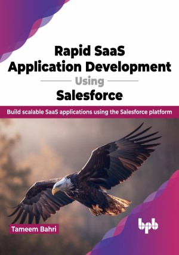

# Rapid SaaS Application Development Using Salesforce

Learn how to rapidly build and document scalable Salesforce applications

This is the repository for [Rapid SaaS Application Development Using Salesforce
](https://bpbonline.com/products/rapid-saas-application-development-using-salesforce?variant=43084709298376),published by BPB Publications.

## About the Book
This book is a practical guide for building secure, scalable, and performant SaaS applications on top of the Salesforce platform. Learn how to dissect a business problem and extract non-communicated requirements. Gain practical knowledge on designing and documenting a Salesforce application using the right mix of low-code development tools such as flows, validation rules, and formula fields and full-code using APEX, Lightning Components, and off-platform modules.

Start with the fundamental concepts of the Salesforce platform and its SaaS application development capabilities. Learn key building blocks like objects, fields, and security models, explore powerful tools like App Builder and Flow Builder, and master the principles of the Salesforce app development lifecycle.

The book will use real-life business scenarios to practically teach you foundational information and skills that you can use to develop enterprise-ready applications. You will gain critical knowledge and skills to put you on track for your journey toward the prestigious Salesforce Certified Technical Architect credentials.

## What You Will Learn
• Develop scalable, extendable, and performant Salesforce applications. 

• Build a fully functional Phonebook application and experience the entire development cycle.

• Design and document a Salesforce application efficiently and effectively using standard artifacts.

• Test and release your Salesforce application.

• Build a lively feedback loop with your application’s end users.
